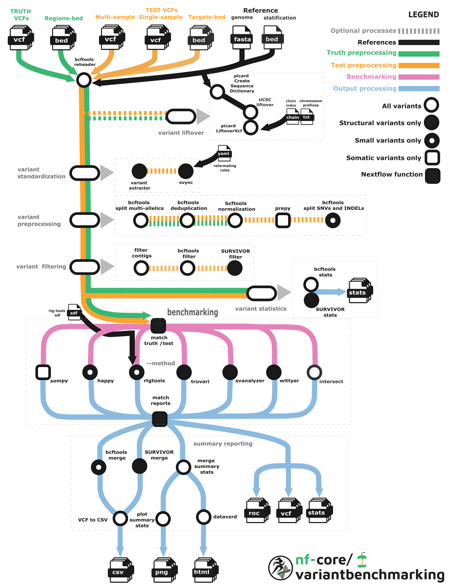

<h1>
  <picture>
    <source media="(prefers-color-scheme: dark)" srcset="docs/images/nf-core-variantbenchmarking_logo_dark.png">
    
  </picture>
</h1>

[](https://github.com/nf-core/variantbenchmarking/actions/workflows/ci.yml)
[](https://github.com/nf-core/variantbenchmarking/actions/workflows/linting.yml)[](https://nf-co.re/variantbenchmarking/results)[](https://doi.org/10.5281/zenodo.14916661)
[](https://www.nf-test.com)

[](https://www.nextflow.io/)
[](https://docs.conda.io/en/latest/)
[](https://www.docker.com/)
[](https://sylabs.io/docs/)
[](https://cloud.seqera.io/launch?pipeline=https://github.com/nf-core/variantbenchmarking)

[](https://nfcore.slack.com/channels/variantbenchmarking)[](https://twitter.com/nf_core)[](https://mstdn.science/@nf_core)[](https://www.youtube.com/c/nf-core)

## Introduction

**nf-core/variantbenchmarking** is designed to evaluate and validate the accuracy of variant calling methods in genomic research. Initially, the pipeline is tuned well for available gold standard truth sets (for example, Genome in a Bottle and SEQC2 samples) but it can be used to compare any two variant calling results. The workflow provides benchmarking tools for small variants including SNVs and INDELs, Structural Variants (SVs) and Copy Number Variations (CNVs) for germline and somatic analysis.

The pipeline is built using [Nextflow](https://www.nextflow.io), a workflow tool to run tasks across multiple compute infrastructures in a very portable manner. It uses Docker/Singularity containers making installation trivial and results highly reproducible. The [Nextflow DSL2](https://www.nextflow.io/docs/latest/dsl2.html) implementation of this pipeline uses one container per process which makes it much easier to maintain and update software dependencies. Where possible, these processes have been submitted to and installed from [nf-core/modules](https://github.com/nf-core/modules) in order to make them available to all nf-core pipelines, and to everyone within the Nextflow community!

<p align="center">
    
</p>

The workflow involves several key processes to ensure reliable and reproducible results as follows:

### Standardization and normalization of variants:

This initial step ensures consistent formatting and alignment of variants in test and truth VCF files for accurate comparison.

- Subsample if input test vcf is multisample ([bcftools view](https://samtools.github.io/bcftools/bcftools.html#view))
- Homogenization of multi-allelic variants, MNPs and SVs (including imprecise paired breakends and single breakends) ([variant-extractor](https://github.com/EUCANCan/variant-extractor))
- Reformatting test VCF files from different SV callers ([svync](https://github.com/nvnieuwk/svync))
- Rename sample names in test and truth VCF files ([bcftools reheader](https://samtools.github.io/bcftools/bcftools.html#reheader))
- Splitting multi-allelic variants in test and truth VCF files ([bcftools norm](https://samtools.github.io/bcftools/bcftools.html#norm))
- Deduplication of variants in test and truth VCF files ([bcftools norm](https://samtools.github.io/bcftools/bcftools.html#norm))
- Left aligning of variants in test and truth VCF files ([bcftools norm](https://samtools.github.io/bcftools/bcftools.html#norm))
- Use prepy in order to normalize test files. This option is only applicable for happy benchmarking of germline analysis ([prepy](https://github.com/Illumina/hap.py/tree/master))
- Split SNVs and indels if the given test VCF contains both. This is only applicable for somatic analysis ([bcftools view](https://samtools.github.io/bcftools/bcftools.html#view))

### Filtering options:

Applying filtering on the process of benchmarking itself might makes it impossible to compare different benchmarking strategies. Therefore, for whom like to compare benchmarking methods this subworkflow aims to provide filtering options for variants.

- Filtration of contigs ([bcftools view](https://samtools.github.io/bcftools/bcftools.html#view))
- Include or exclude SNVs and INDELs ([bcftools filter](https://samtools.github.io/bcftools/bcftools.html#filter))
- Size and quality filtering for SVs ([SURVIVOR filter](https://github.com/fritzsedlazeck/SURVIVOR/wiki))

### Liftover of vcfs:

This sub-workflow provides option to convert genome coordinates of truth VCF and test VCFs and high confidence BED file to a new assembly. Golden standard truth files are build upon specific reference genomes which makes the necessity of lifting over depending on the test VCF in query. Lifting over one or more test VCFs is also possible.

- Create sequence dictionary for the reference ([picard CreateSequenceDictionary](https://gatk.broadinstitute.org/hc/en-us/articles/360037068312-CreateSequenceDictionary-Picard)). This file can be saved and reused.
- Lifting over VCFs ([picard LiftoverVcf](https://gatk.broadinstitute.org/hc/en-us/articles/360037060932-LiftoverVcf-Picard))
- Lifting over high confidence coordinates ([UCSC liftover](http://hgdownload.cse.ucsc.edu/admin/exe))

### Statistical inference of input test and truth variants:

This step provides insights into the distribution of variants before benchmarking by extracting variant statistics:.

- SNVs, INDELs and complex variants ([bcftools stats](https://samtools.github.io/bcftools/bcftools.html#stats))
- SVs by type ([SURVIVOR stats](https://github.com/fritzsedlazeck/SURVIVOR/wiki))

### Benchmarking of variants:

Actual benchmarking of variants are split between SVs and small variants:

Available methods for germline and somatic _structural variant (SV)_ benchmarking are:

- Truvari ([truvari bench](https://github.com/acenglish/truvari/wiki/bench))
- SVanalyzer ([svanalyzer benchmark](https://github.com/nhansen/SVanalyzer/blob/master/docs/svbenchmark.rst))

> [!NOTE]
> Please note that there is no somatic specific tool for SV benchmarking in this pipeline.

Available methods for germline and somatic _CNVs (copy number variations)_ are:

- Truvari ([truvari bench](https://github.com/acenglish/truvari/wiki/bench))
- Wittyer ([witty.er](https://github.com/Illumina/witty.er/tree/master))

> [!NOTE]
> Please note that there is no somatic specific tool for CNV benchmarking in this pipeline.

Available methods for *small variants: SNVs and INDEL*s:

- Germline variant benchmarking using ([rtg vcfeval](https://realtimegenomics.com/products/rtg-tools))
- Germline variant benchmarking using ([hap.py](https://github.com/Illumina/hap.py/blob/master/doc/happy.md))
- Somatic variant benchmarking using ([som.py](https://github.com/Illumina/hap.py/tree/master?tab=readme-ov-file#sompy))

### Intersection of benchmark regions:

Intersecting test and truth BED regions produces benchmark metrics. Intersection analysis is especially recommended for _CNV benchmarking_ where result reports may variate per tool.

- Convert SV or CNV VCF file to BED file, if no regions file is provided for test case using ([SVTK vcf2bed](https://github.com/broadinstitute/gatk-sv/blob/main/src/svtk/scripts/svtk))
- Convert VCF file to BED file, if no regions file is provided for test case using ([Bedops convert2bed](https://bedops.readthedocs.io/en/latest/content/reference/file-management/conversion/convert2bed.html#convert2bed))
- Intersect the regions and gether benchmarking statistics using ([bedtools intersect](https://bedtools.readthedocs.io/en/latest/content/tools/intersect.html))

### Comparison of benchmarking results per TP, FP and FN files

It is essential to compare benchmarking results in order to infer uniquely or commonly seen TPs, FPs and FNs.

- Merging TP, FP and FN results for happy, rtgtools and sompy ([bcftools merge](https://samtools.github.io/bcftools/bcftools.html#merge))
- Merging TP, FP and FN results for Truvari and SVanalyzer ([SURVIVOR merge](https://github.com/fritzsedlazeck/SURVIVOR/wiki))
- Conversion of VCF files to CSV to infer common and unique variants per caller (python script)

### Reporting of benchmark results

The generation of comprehensive report that consolidates all benchmarking results.

- Merging summary statistics per benchmarking tool (python script)
- Plotting benchmark metrics per benchmarking tool (R script)
- Create visual HTML report for the integration of NCBENCH ([datavzrd](https://datavzrd.github.io/docs/index.html))
- Apply _MultiQC_ to visualize results

## Usage

> [!NOTE]
> If you are new to Nextflow and nf-core, please refer to [this page](https://nf-co.re/docs/usage/installation) on how to set-up Nextflow. Make sure to [test your setup](https://nf-co.re/docs/usage/introduction#how-to-run-a-pipeline) with `-profile test` before running the workflow on actual data.

First, prepare a samplesheet with your input data that looks as follows:

`samplesheet.csv`:

```csv
id,test_vcf,caller
test1,test1.vcf.gz,delly
test2,test2.vcf,gatk
test3,test3.vcf.gz,cnvkit
```

Each row represents a vcf file (test-query file). For each vcf file and variant calling method (caller) have to be defined.

User _has to provide truth_vcf and truth_id in config files_.

> [!NOTE]
> There are publicly available truth sources. For germline analysis, it is common to use [genome in a bottle (GiAB)](https://www.nist.gov/programs-projects/genome-bottle) variants. There are variate type of golden truths and high confidence regions for hg37 and hg38 references. Please select and use carefully.
> For somatic analysis, [SEQC2 project](https://sites.google.com/view/seqc2/home/data-analysis/high-confidence-somatic-snv-and-indel-v1-2) released SNV, INDEL and CNV regions. One, can select and use those files.

For more details and further functionality, please refer to the [usage documentation](https://nf-co.re/variantbenchmarking/usage) and the [parameter documentation](https://nf-co.re/variantbenchmarking/parameters).

Now, you can run the pipeline using:

```bash
nextflow run nf-core/variantbenchmarking \
   -profile <docker/singularity/.../institute> \
   --input samplesheet.csv \
   --outdir <OUTDIR> \
   --genome GRCh37 \
   --analysis germline \
   --truth_id HG002 \
   --truth_vcf truth.vcf.gz
```

> [!WARNING]
> Please provide pipeline parameters via the CLI or Nextflow `-params-file` option. Custom config files including those provided by the `-c` Nextflow option can be used to provide any configuration _**except for parameters**_; see [docs](https://nf-co.re/docs/usage/getting_started/configuration#custom-configuration-files).
> Conda profile is not available for SVanalyzer (SVBenchmark) tool, if you are planing to use the tool either choose docker or singularity.

## Pipeline output

To see the results of an example test run with a full size dataset refer to the [results](https://nf-co.re/variantbenchmarking/results) tab on the nf-core website pipeline page.
For more details about the output files and reports, please refer to the
[output documentation](https://nf-co.re/variantbenchmarking/output).

This pipeline outputs benchmarking results per method besides to the inferred and compared statistics.

## Credits

nf-core/variantbenchmarking was originally written by Kübra Narcı ([@kubranarci](https://github.com/kubranarci)) as a part of benchmarking studies in German Human Genome Phenome Archieve Project ([GHGA](https://www.ghga.de/)).

We thank the following people for their extensive assistance in the development of this pipeline:

- Nicolas Vannieuwkerke ([@nvnienwk](https://github.com/nvnieuwk)),
- Maxime Garcia ([@maxulysse](https://github.com/maxulysse)),
- Sameesh Kher ([@khersameesh24](https://github.com/khersameesh24))
- Florian Heyl ([@heylf](https://github.com/heyl))
- Krešimir Beštak ([@kbestak](https://github.com/kbestak))
- Elad Herz ([@EladH1](https://github.com/EladH1))

## Acknowledgements

<a href="https://www.ghga.de/">
  
</a>

## Contributions and Support

If you would like to contribute to this pipeline, please see the [contributing guidelines](.github/CONTRIBUTING.md).

For further information or help, don't hesitate to get in touch on the [Slack `#variantbenchmarking` channel](https://nfcore.slack.com/channels/variantbenchmarking) (you can join with [this invite](https://nf-co.re/join/slack)).

## Citations

If you use nf-core/variantbenchmarking for your analysis, please cite it using the following doi: [110.5281/zenodo.14916661](https://doi.org/10.5281/zenodo.14916661)

An extensive list of references for the tools used by the pipeline can be found in the [`CITATIONS.md`](CITATIONS.md) file.

You can cite the `nf-core` publication as follows:

> **The nf-core framework for community-curated bioinformatics pipelines.**
>
> Philip Ewels, Alexander Peltzer, Sven Fillinger, Harshil Patel, Johannes Alneberg, Andreas Wilm, Maxime Ulysse Garcia, Paolo Di Tommaso & Sven Nahnsen.
>
> _Nat Biotechnol._ 2020 Feb 13. doi: [10.1038/s41587-020-0439-x](https://dx.doi.org/10.1038/s41587-020-0439-x).
